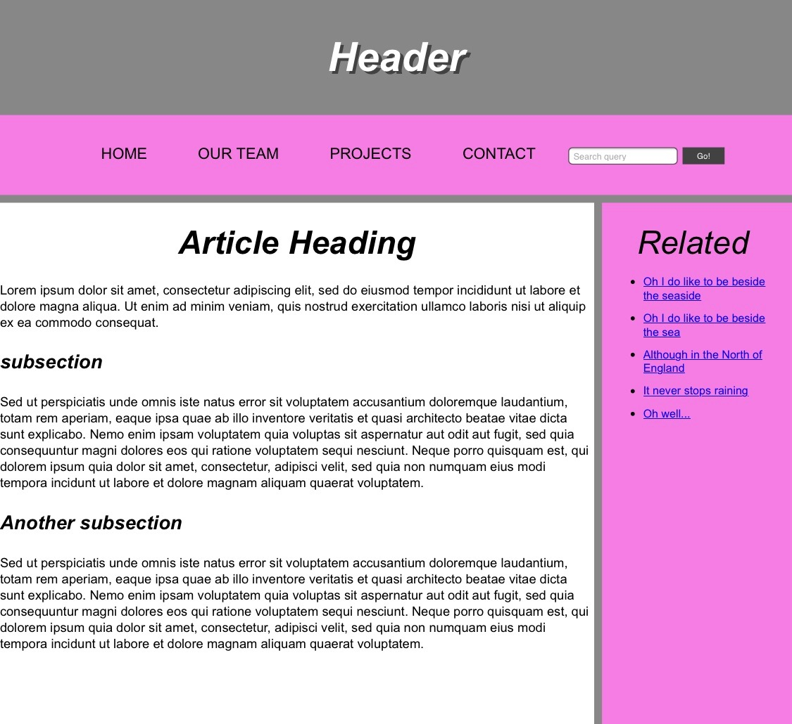
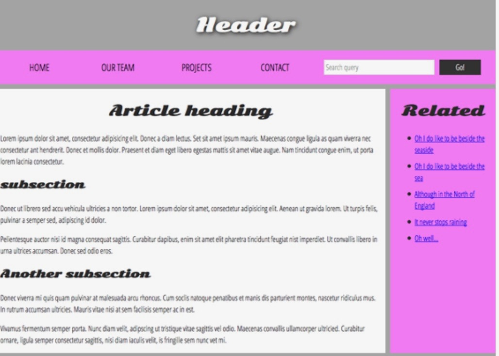

# COMP20 (Web Programming) Repository

## HW1
Simple first web page using HTML and basic CSS. Hosted [here](http://sevans09.github.io/web-programming/HW1).

## HW2
Web page peddling a fake service using HTML and more complex CSS. 
Hosted [here](http://sevans09.github.io/web-programming/HW2).

## HW3
Created a mockup of a given template page. 
Hosted [here](http://sevans09.github.io/web-programming/HW3a).

My version:

Template:

